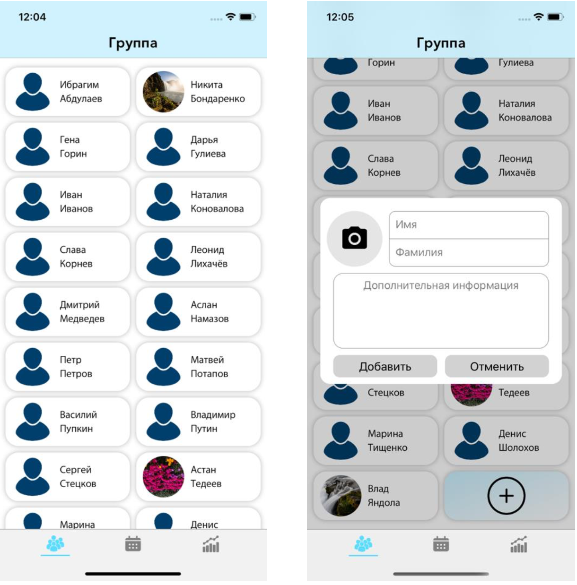
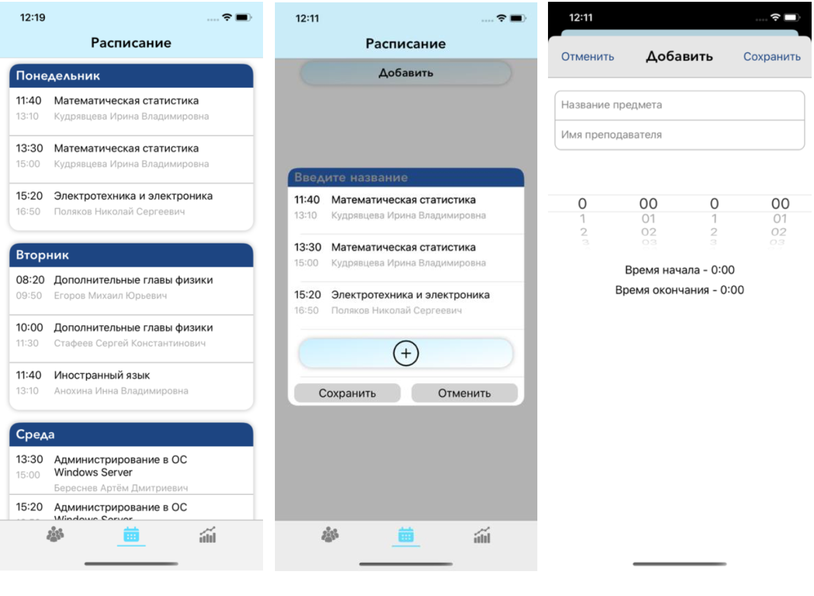
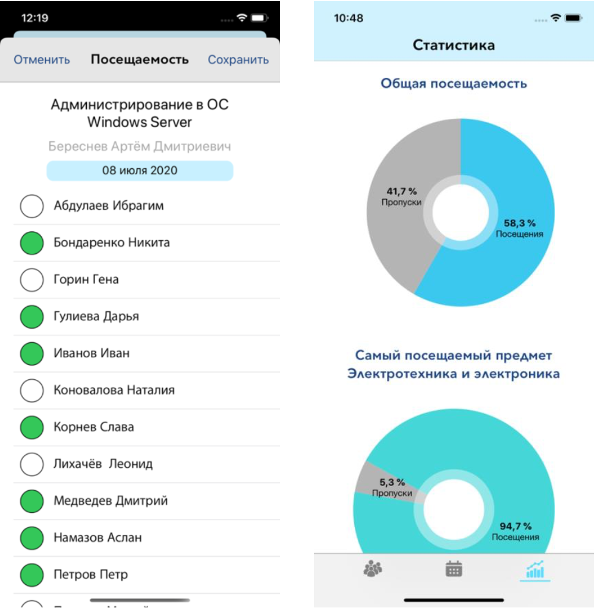

# Big eye

## Описание

Big eye - это приложение для отслеживание посещаемости учеников/студентов.
В нем можно создать группу, сформировать для нее расписание и отмечать присутствие на занятиях. В результате можно будет просмотреть статистику посещений по каждому студенту и по группе в целом

Технологический стек:
- AutoLayout
- CoreData
- UIViewAnimation, CoreAnimation
- XCTest

Архитектурные паттерны:
- SOA, MVC

## Демонстрация

Просмотр группы и добавление нового студента

Просмотр расписания и добавление новой ячейки

Заполнение посещаемости и просмотр статистики
